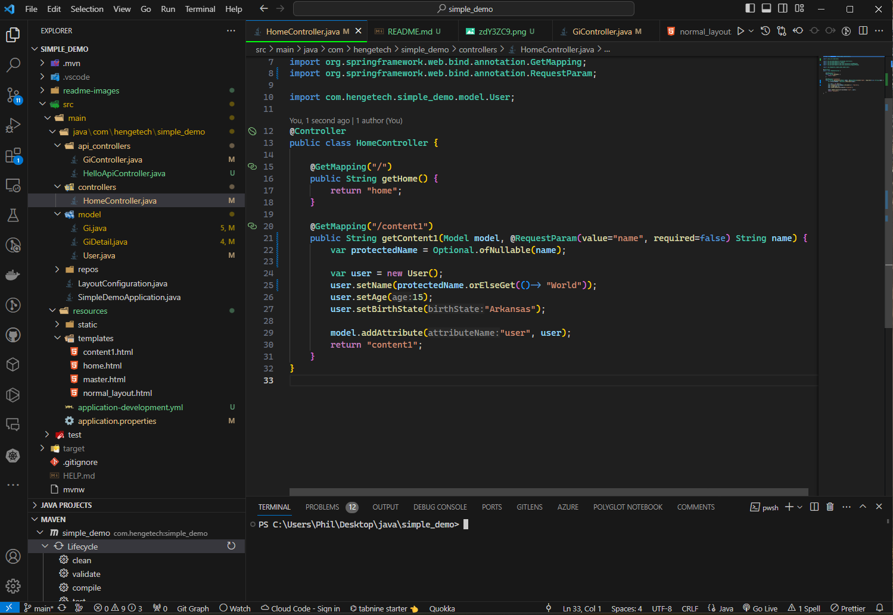
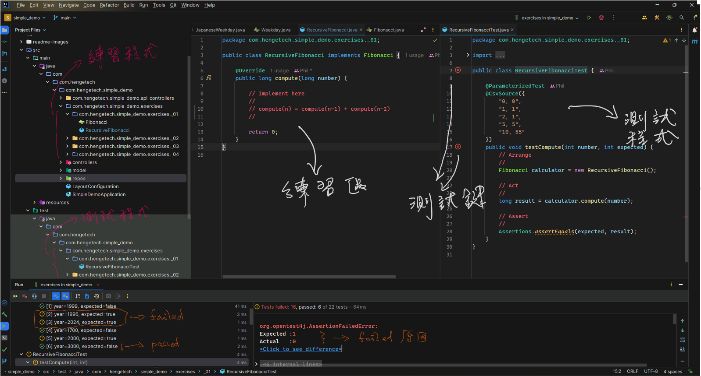
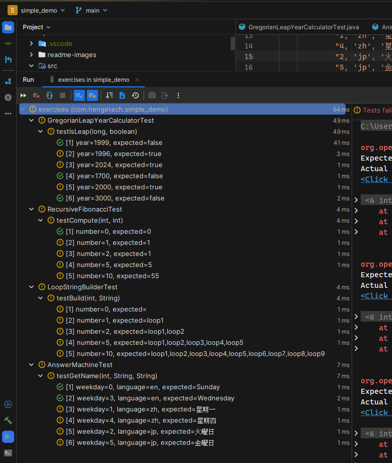
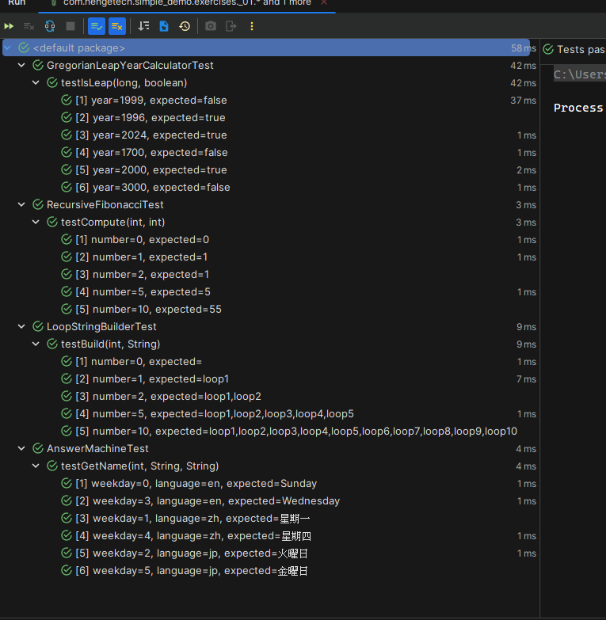
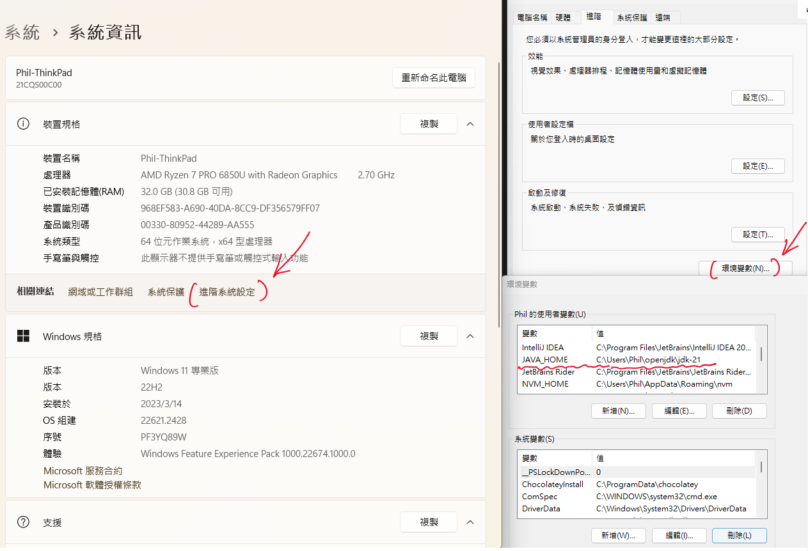
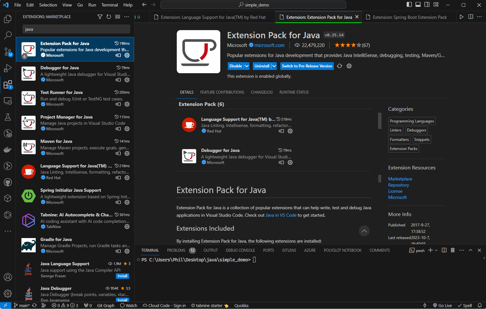
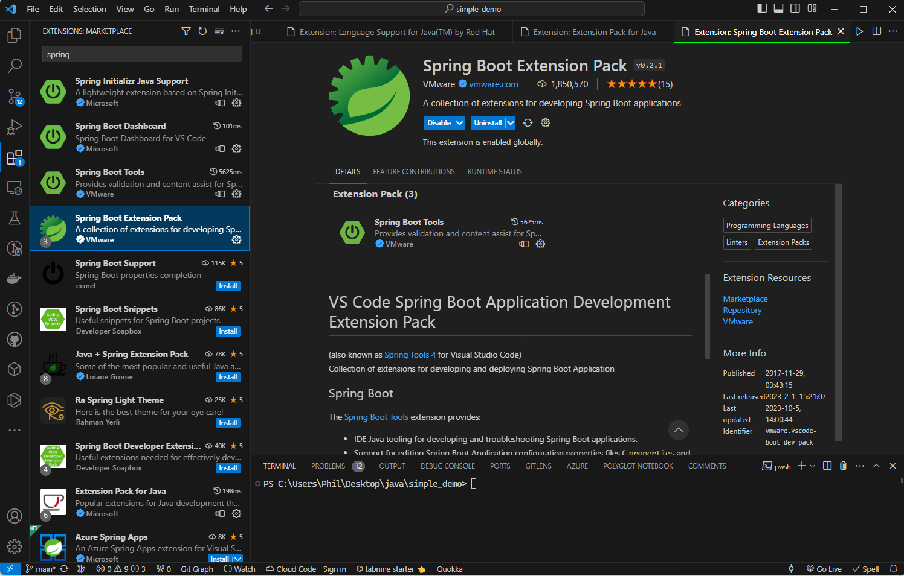
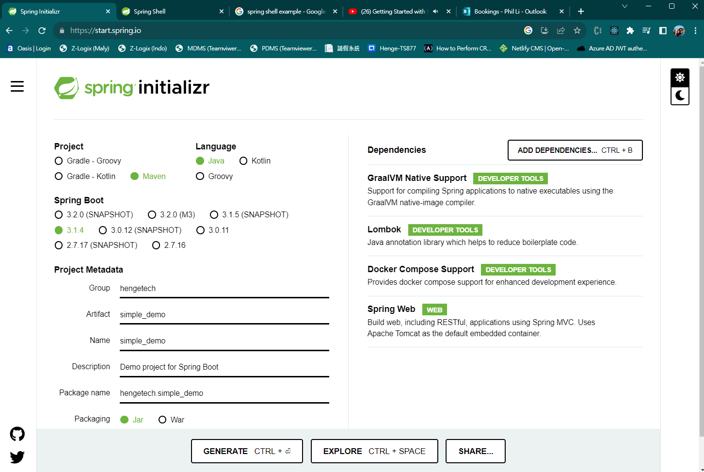

# Java 17 with Maven and Springboot in VSCode


<div align="center">
  <kbd>
    
  </kbd>
</div>

## 說明

使用 VS Code 開發 Springboot MVC 專案

### Java 練習

使用 Intellij Community 2023.2

<div align="center">
  <kbd>
    
  </kbd>
</div>

1. 主程式: /src/main/java/com.hengetech.simple_demo/exercises/ _01..._04
2. 測試程式: /src/test/java/com.hengetech.simple_demo/exercises/ _01..._04
3. 從測試程式可以看到輸入值及預期輸出值, 再把主程式完成以滿足測試的條件。
3. 分別完成主程式 exercises 內的程式, 程式的完成以測試程式是否通過測試為目的 
4. 測試程式不用變動, 僅用來檢驗主程式的執行結果。程式完成後, 測試結果應該全部呈現綠色通過標誌。
1. 完成後的參考程式在位 branch: exercise_01_04, https://github.com/FreePhil/maven_basic/tree/exercise_01_04 
<div>
  <kbd>
    
  </kbd>
</div>
<div>
  <kbd>
    
  </kbd>
</div>

### 軟體下載

- [VS Code](https://code.visualstudio.com/download)
- [Java JDK 17](https://www.openlogic.com/openjdk-downloads)

### Java Jdk Setup
<div align="center">
  <kbd>
    
  </kbd>
</div>


### VS Code Plugin

- Java Extension Plugin
  <div align="center">
  <kbd>
    
  </kbd>
</div>

- Spring Boot Plugin
    <div align="center">
  <kbd>
    
  </kbd>
</div>

- Extra Plugins
  - [19 Great VS Code Extensions](https://www.wearedevelopers.com/magazine/vs-code-extensions)
  - [20 Best VS Code Extensions For 2023](https://www.lambdatest.com/blog/best-vs-code-extensions/)
  - [Top 30 VS Code Extensions for Enhanced Programming](https://kinsta.com/blog/vscode-extensions/)

### Spring Initializer

https://start.spring.io/
  
<div align="center">
  <kbd>
    
  </kbd>
</div>

### Query URL
  - Web: http://localhost:8080/content1
  - Web: http://localhost:8080/content1?name=HengeTech
  - Rest API: http://localhost:8080/gi/fix-wired

### Class Comparison
<table>
<tr>
<th> Java </th>
<th> C# </th>
</tr>
<tr>
<td>

```java
package com.hengetech.simple_demo.model;

import lombok.Data;
import lombok.NoArgsConstructor;
import java.io.Serializable;

@Data
@NoArgsConstructor
public class User implements Serializable {
    private String name;
    private int age;
    private String birthState;    
}
```

</td>
<td>

```c#
using System;
using System.Text.Json.Serialization;

namespace SimpleLog.Models
{
    public class User: Object
    {
        [JsonPropertyName("username")]
        public string Name { get; set; }
        public int Age { get; set; }
        public DateTime Birthday { get; set; }
    }
}
```

</td>
</tr>
<tr>
<td>

```agsl
var user = new User();
user.setName("Henge");
var tempName = user.getName();
```
</td>
<td>

```agsl
var user = new User();
user.Name = "Henge";
var tempName = user.Name;
```
</td>
</tr>
</table>

### Naming Conventions

- namespace: 全部小寫或_, i.e., <span style="color:yellow">com.henge.maven_basic</span>
- class/interface: 大寫開頭 Pascal Style, i.e., <span style="color:yellow">Car, ToyotaCar, ToyotaCRVCar</span>
- variable: 小寫開頭 Camel Style, i.e., <span style="color:yellow">userName, location, createdDate</span>
- method/function: 小寫開頭 Camel Style, i.e., <span style="color:yellow">getUserName, findLocation</span>
- interface
  ```
  public interface Car {
    String getMake();
  }
  ```
- class
  ```
  public class ToyotaCar implements Car {
    public String getMake() {
      return "Toyota";
    }
  }  

  or 

  public class CarImpl implements Car {
    ....
    ....
    ....
  }

  public class ToyotaCRVCar extends ToyotaCar {
    @Override public String getMake() {
      return "Toyota-CRV";
    }
  }
  ```

### Dependency: pom.xml 
```
<properties>
    <java.version>17</java.version>
</properties>
<dependencies>
    <dependency>
        <groupId>org.springframework.boot</groupId>
        <artifactId>spring-boot-starter-data-jpa</artifactId>
    </dependency>
    <dependency>
        <groupId>org.springframework.boot</groupId>
        <artifactId>spring-boot-starter-thymeleaf</artifactId>
    </dependency>
    <dependency>
        <groupId>org.springframework.boot</groupId>
        <artifactId>spring-boot-starter-web</artifactId>
    </dependency>
    <dependency>
        <groupId>nz.net.ultraq.thymeleaf</groupId>
        <artifactId>thymeleaf-layout-dialect</artifactId>
        <version>3.3.0</version>
    </dependency>

    <dependency>
        <groupId>org.springframework.boot</groupId>
        <artifactId>spring-boot-devtools</artifactId>
        <scope>runtime</scope>
        <optional>true</optional>
    </dependency>
    <dependency>
        <groupId>org.springframework.boot</groupId>
        <artifactId>spring-boot-configuration-processor</artifactId>
        <optional>true</optional>
    </dependency>
    <dependency>
        <groupId>org.projectlombok</groupId>
        <artifactId>lombok</artifactId>
        <optional>true</optional>
    </dependency>
    <dependency>
        <groupId>com.microsoft.sqlserver</groupId>
        <artifactId>mssql-jdbc</artifactId>
        <version>12.4.1.jre11</version>
        <scope>runtime</scope>
    </dependency>
    <dependency>
        <groupId>org.springframework.boot</groupId>
        <artifactId>spring-boot-starter-test</artifactId>
        <scope>test</scope>
    </dependency>
</dependencies>
```

